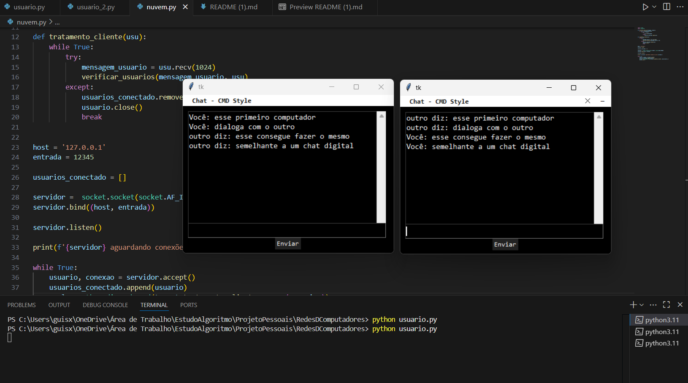
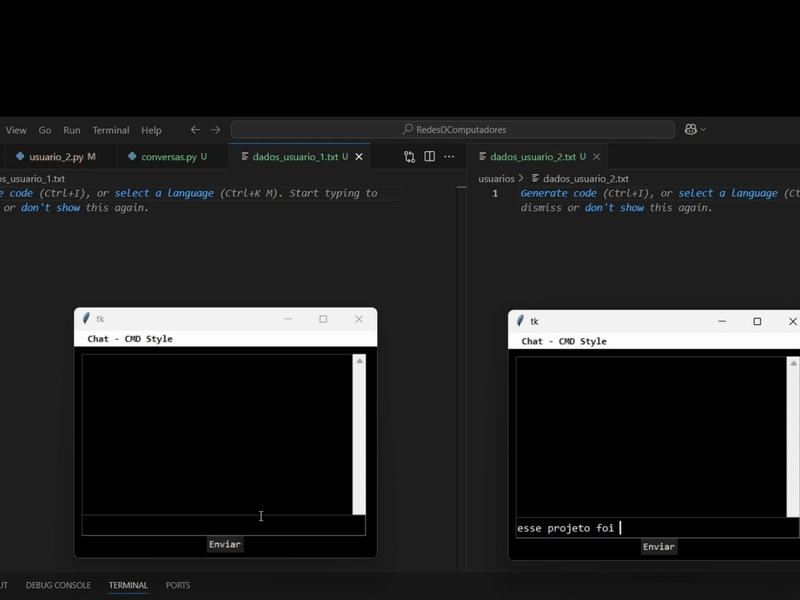
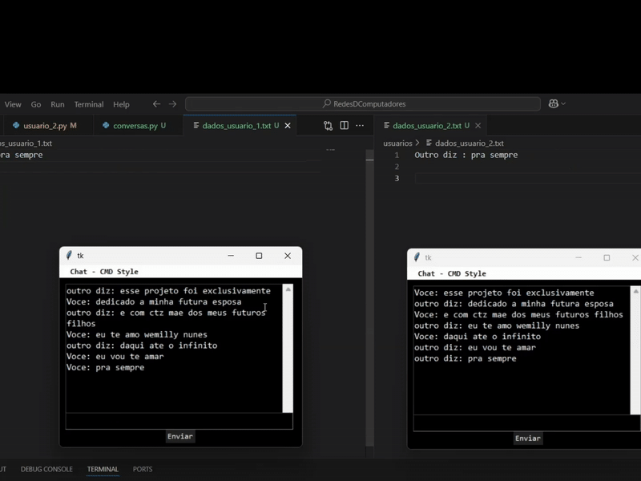

# 💬 PyChat - Chat em Python com Janelas(Guias)


<p align="center">
<a href="#tecnologias">introducao📚</a>
<a href="#funcionalidades">como funciona?🎮</a>
<a href="#executar">como executar?🛠️</a>
<a href="#aprendizados">o que foi compreendido?🧠</a>
<a href="#imagens">imagens do projeto📸</a>
<a href="#futuro">o que melhorar?📝</a>
</p>

Projeto desenvolvido a fins de aprendizado, com o objetivo de compreender na prática os conceitos de **redes de computadores** e **comunicação via sockets TCP/IP**.  
A aplicação permite a troca de mensagens entre dois arquivos conectados em rede local (LAN), utilizando uma janela(guia) feita com Tkinter.

---

# tecnologias

- 🐍 Python - 3 arquivos, nuvem.py, usuario.py e usuario_2.py
- 🧱 Biblioteca Sockets (TCP/IP)
- 🖼️ Biblioteca Tkinter (Para janelas e seus estilos CMD)
- 🧵 Biblioteca Threads (para comunicação assíncrona)
- 💾 Salvamento de 3 linhas de conversas anteriores(Em arquivo Txt)

---

# funcionalidades

- Envio e recebimento de mensagens em tempo real
- Interface simples e semelhante ao terminal (estilo CMD windows)
- Execução simultânea sem travar a interface (graças a threads)
- Personalização visual com foco em estética de computador "retrô"

---

# executar

1. Clone o repositório:
   ```bash
   git clone https://github.com/seuusuario/pychat.git
   cd pychat
   ```

   ```bash
   Ou baixe os arquivos disponíveis na branch mais recente e extraia para uma pasta
   ```

2. Execute o servidor:
   ```bash
   cd servidor
   python nuvem.py
   ```

3. Execute o cliente:
   ```bash
   cd usuarios
   python cliente.py
   ```

> **Observação:** Altere o IP do host no código para corresponder ao IP da máquina que está executando o servidor e também certifique que esta na pasta raiz do projeto. Para obter os certificados TLS na sua máquina <a href="https://www.youtube.com/watch?v=HZ2OKVu5O0s&t=276s">no link</a>.

---

# imagens





---
uma pequena menção para minha futura esposa

# aprendizados

Esse projeto ajudou no entendimento de:
- Estabelecimento de conexões via TCP/IP
- Gerenciamento de múltiplas threads
- Criação de interfaces gráficas com Tkinter
- Comunicação em rede de forma simultânea
- Criptografia de mensagens (simples ou TLS)
- Histórico de conversa salvo localmente em TXT
 
---

# futuro

      É esperado os aprendizados adquiridos e concebidos no projeto uma contribuição maior em projetos mais complexos. Atualmente, é compreendido conceitos básicos em prática de TCP/IP, TLS e SSL em um chat montado com dois arquivos.
